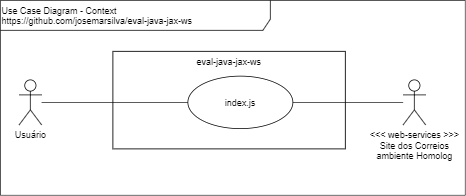
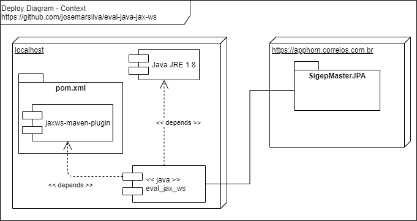

# eval-java-jax-ws
Evaluation Java JAX WS SOAP Client


## 1. Introduction

Project **eval-java-jax-ws** is an evaluation of Java JAX WS.

## 2. Diagrams

### 2.1. Use Case Diagram

 


### 2.2. Deploy Diagram

 


## 3. Technologies Used
* Java JDK 1.8 (jar file includes runnable)
* Eclipse (JEEE 2019 versionrecommended)
* Maven 3.6.3 ( ou superior)

## 4. Project

### 4.1. Guide for Users

* n/a

### 4.2. Guide for Developers

#### 4.2.1. Generate SOAP classes

* Maven Clean

```cmd
C:\...\eval-java-jax-ws>mvn clean
```

* Maven Generate JAXWS

```cmd
C:\...\eval-java-jax-ws>mvn jaxws:wsimport
[INFO] Scanning for projects...
[INFO]
[INFO] ----------------< br.com.josemarsilva:eval-java-jax-ws >----------------
[INFO] Building eval-java-jax-ws 0.0.1-SNAPSHOT
[INFO] --------------------------------[ pom ]---------------------------------

[INFO] --- jaxws-maven-plugin:2.3:wsimport (default-cli) @ eval-java-jax-ws ---
[INFO] Processing: https://apphom.correios.com.br/SigepMasterJPA/AtendeClienteService/AtendeCliente?wsdl
[INFO] jaxws:wsimport args: [-keep, -s, C:\GitHome\ws-github-02\eval-java-jax-ws\src\main\java, -d, C:\GitHome\ws-github-02\eval-java-jax-ws\target\classes, -encoding, UTF-8, -Xnocompile, -Xdebug, "https://apphom.correios.com.br/SigepMasterJPA/AtendeClienteService/AtendeCliente?wsdl"]
[DEBUG] Arquivo de autorização "C:\Users\Josemar Silva\.metro\auth" não encontrado. Se o acesso do WSDL precisar da Autenticação Básica, forneça o arquivo de autorização com o acesso de leitura em C:\Users\Josemar Silva\.metro\auth ou use -Xauthfile para fornecer o arquivo de autorização em cada linha para fornecer informações de autorização usando este formato : http[s]://user:password@host:port//<url-path>


fazendo parse do WSDL...


Gerando o código...

[INFO] ------------------------------------------------------------------------
[INFO] BUILD SUCCESS
[INFO] ------------------------------------------------------------------------
[INFO] Total time:  5.080 s
[INFO] Finished at: 2020-06-01T19:45:42-03:00
[INFO] ------------------------------------------------------------------------
```

#### 4.2.2. Customize your classes

```java-jax-ws
	:
	public static void main(String[] args) {
		ConsultaCEP consultaCEP = new ConsultaCEP();
		consultaCEP.setCep("13050410");
		System.out.println( consultaCEP.getCep() );
	}
	:
```


### 4.3. Guide for Configuration

* n/a

### 3.4. Guide for Test

* n/a

### 3.5. Guide for Demonstration

* n/a

### 3.7. Patterns, Standard, Conventions and Best Practices

* n/a


## I - References

* Tutorial
  * https://www.youtube.com/watch?v=2ToEge_xybI&feature=youtu.be
  * https://examples.javacodegeeks.com/enterprise-java/jws/jax-ws-tutorial-beginners/
  * https://www.youtube.com/watch?v=FqDenKN5y1s
  * https://www.eclipse.org/webtools/community/education/web/t320/Generating_a_client_from_WSDL.pdf
  * https://www.youtube.com/watch?v=11iGyrvBhzc

* Plugin Guide
  * https://www.mojohaus.org/jaxws-maven-plugin/wsimport-mojo.html

* Troubleshooting
  * https://github.com/mojohaus/jaxws-maven-plugin/issues/4
  * https://howtodoinjava.com/maven/change-local-repository-location/
